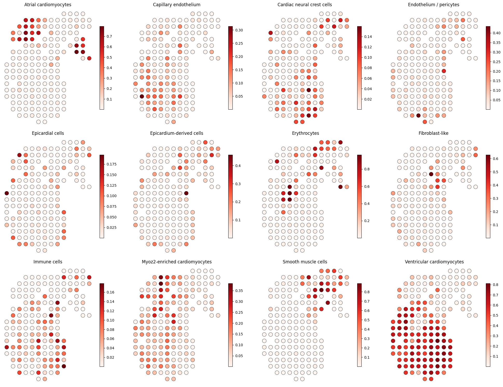

# :zap: flash-scope

## 🧬 Method

`flash-scope` is the lightweight and speedy successor to [stereoscope](https://github.com/almaan/stereoscope) :zap:.
The code has been optimized, but we've also changed the parameter estimation
algorithm from MLE to Method of Moments, which allows for extremely fast
inference of the cell type level negative binomial parameters used to
deconvolve the spatial data. In addition to these improvements, we provide a
user-friendly API as well as an MCP layer for AI-integrations.

`flash-scope`, just like `stereoscope`, estimates cell type proportions in
spatial transcriptomics data by fitting a negative binomial (NB) mixture model.
Given a single-cell RNA-seq reference with cell type labels and a spatial
dataset:

1. 📊 **NB parameter estimation** — Per-gene, per-cell-type NB parameters (r, p) are estimated from the reference using method-of-moments, with optional GPU acceleration for large references.

2. 🧮 **Mixture model fitting** — A PyTorch model learns per-spot mixing weights over cell types, gene-level scaling factors, and a background expression term. The spatial counts are modeled as a mixture of the reference NB distributions. The model is trained by maximizing the NB log-likelihood.

3. 📈 **Proportion extraction** — Learned mixing weights are normalized via softplus to produce non-negative proportions that sum to one per spot.


## 📦 Install

### GitHub

```bash
git clone https://github.com/almaan/flash-scope.git

cd flash-scope

pip install flash-scope

# with MCP server support
pip install "flash-scope[mcp]"

# development
pip install -e ".[dev,mcp]"
```
### 
PyPI <Coming Soon> 

## 🚀 Quick start

End-to-end deconvolution in one call:

```python
import flash_scope as fs

props = fs.tl.deconvolve(ad_sc, ad_sp, label_col="cell_type")
```

`deconvolve` handles preprocessing, parameter estimation, model fitting, and proportion extraction. For more control, use the step-by-step API:

```python
import flash_scope as fs

ad_sc, ad_sp = fs.pp.preprocess(ad_sc, ad_sp, label_col="cell_type")
R, P, labels = fs.model.estimate_nb_params(ad_sc, label_col="cell_type", return_labels=True)

model = fs.model.FlashScopeModel(
    R.values, P.values,
    n_spots=ad_sp.n_obs, n_types=len(labels), n_genes=ad_sp.n_vars,
)
model = fs.model.fit(model, ad_sp, epochs=500, device="auto")
props = model.get_proportions()  # (n_spots, n_types) numpy array
```

## 💾 I/O adapters

All adapters produce AnnData objects:

```python
ad_sc = fs.io.read_h5ad("reference.h5ad")
ad_sp = fs.io.read_parquet("spatial.parquet", obs_columns=["x", "y"])
ad_sp = fs.io.read_csv("spatial.csv", gene_columns=["GeneA", "GeneB"])
```

## 🧹 Preprocessing

```python
# full pipeline
ad_sc, ad_sp = fs.pp.preprocess(
    ad_sc, ad_sp,
    label_col="cell_type",
    min_label_member=20,    # drop cell types with < 20 cells
    min_sc_counts=100,      # filter low-count genes in reference
    min_sp_counts=100,      # filter low-count genes in spatial
    gene_list=None,         # optional: restrict to specific genes
)

# or individually
ad_sc = fs.pp.filter_by_label(ad_sc, "cell_type", min_count=20)
ad_sc = fs.pp.filter_genes(ad_sc, min_counts=100)
ad_sc, ad_sp = fs.pp.intersect_vars(ad_sc, ad_sp)
ad_sp = fs.pp.densify(ad_sp)  # sparse -> dense
```

## ⚡ GPU acceleration

```python
# model training (auto-detects CUDA)
props = fs.tl.deconvolve(ad_sc, ad_sp, label_col="cell_type", device="auto")

# NB parameter estimation on GPU (for large references)
R, P = fs.model.estimate_nb_params(ad_sc, label_col="cell_type", backend="torch")
```

When running on CUDA, the trainer applies `torch.compile` and mixed-precision (`float16`) automatically.

## 🤖 MCP server

Flash-scope includes an MCP server so LLM agents (Claude, etc.) can run deconvolution interactively.

### Adding to Claude Code

Add to your Claude Code MCP settings (`.claude/settings.json` or project-level):

```json
{
  "mcpServers": {
    "flash-scope": {
      "command": "python",
      "args": ["-m", "flash_scope.mcp"]
    }
  }
}
```

Or if installed in a specific environment:

```json
{
  "mcpServers": {
    "flash-scope": {
      "command": "/path/to/env/bin/python",
      "args": ["-m", "flash_scope.mcp"]
    }
  }
}
```

### Available MCP tools

| Tool | Description |
|------|-------------|
| `load_reference(path, format)` | Load scRNA-seq reference (h5ad, parquet, csv) |
| `load_spatial(path, format)` | Load spatial data |
| `preprocess_data(label_col, ...)` | Filter and intersect genes |
| `fit_model_tool(label_col, epochs, batch_size)` | Run deconvolution |
| `get_proportions(top_n)` | Get per-spot cell type proportions as JSON |

### Programmatic start

```python
from flash_scope.mcp import serve
serve()
```

## 📖 API reference

### `fs.tl.deconvolve(ad_sc, ad_sp, label_col, **kwargs) -> DataFrame`

High-level entry point. Accepts a single AnnData or a list (auto-concatenated). Returns a DataFrame of proportions indexed by spot, with cell types as columns.

### `fs.model.estimate_nb_params(adata, label_col, backend="numpy") -> (R, P)`

Estimate NB parameters from reference. `backend="torch"` runs on GPU.

### `fs.model.FlashScopeModel(r, p, n_spots, n_types, n_genes)`

PyTorch module. Call `.get_proportions()` after fitting for a `(n_spots, n_types)` numpy array.

### `fs.model.fit(model, adata, epochs=500, batch_size=1024, device="auto") -> model`

Train the model. Returns fitted model on CPU.


## Example
Results on the human developmental heart, same as in [Figure 3](https://www.nature.com/articles/s42003-020-01247-y/figures/3) in the original [publication](https://www.nature.com/articles/s42003-020-01247-y). 

The analysis was run with the following command:
```python

%%timeit
import flash_scope as fs
props = fs.tl.deconvolve(ad_sc,
                         ad_sp,
                         label_col='celltype',
                         epochs=5000,
                         verbose = True,
                         warm_start=True,
                         gene_list=hvg_list,
                         shrinkage=True, 
                         patience=-1)
                         
```
producing:
```
[flash-scope] after filtering: 590 genes, 12 cell types
[flash-scope] NB params estimated for 12 types x 590 genes
[flash-scope] computing NNLS warm-start for mixing weights
[flash-scope] fitting on cuda (5000 epochs, batch_size=1024)
[flash-scope]   epoch    1/5000  loss=255059.2656
[flash-scope]   epoch  501/5000  loss=150093.8438
[flash-scope]   epoch 1001/5000  loss=146266.0000
[flash-scope]   epoch 1501/5000  loss=145368.7812
[flash-scope]   epoch 2001/5000  loss=144834.5000
[flash-scope]   epoch 2501/5000  loss=144630.1406
[flash-scope]   epoch 3001/5000  loss=144554.1562
[flash-scope]   epoch 3501/5000  loss=144528.5469
[flash-scope]   epoch 4001/5000  loss=144518.2969
[flash-scope]   epoch 4501/5000  loss=144512.0000
[flash-scope]   epoch 5000/5000  loss=144509.1406
[flash-scope] preprocessing (159 spots, 3777 cells)
```

and with a time of: `9.95 s ± 133 ms per loop (mean ± std. dev. of 7 runs, 1 loop each)`

The results are:


